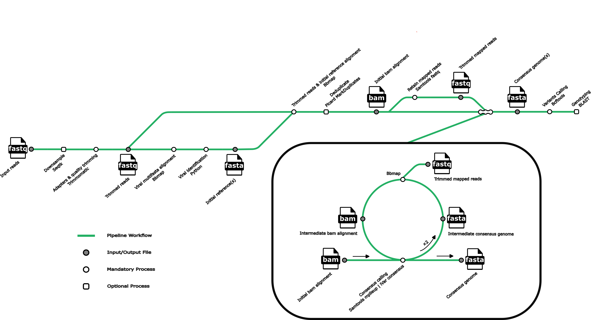

# REVICA

Revica is a reference-based viral consensus genome assembly pipeline for some of the most common respiratory viruses. Revica is written in [Nextflow](https://www.nextflow.io/) and can be run in [Docker](https://docs.docker.com/get-docker/). Revica currently supports consensus genome assembly of:
- Enterovirus A-D (EV)
- Rhinovirus (RV)
- Seasonal human coronavirus (HCOV)
- Human metapneumovirus (HMPV)
- Human respiratory syncytial virus (HRSV)
- Human parainfluenza virus (HPIV)
- Measles morbillivirus (MeV)
- Influenza A virus (IAV)
- Influenza B virus (IBV)
- Human adenovirus (HAdV)

## Workflow

## Usage
Install [`Nextflow`](https://www.nextflow.io/docs/latest/getstarted.html#installation) (`>=21.10.3`)

Install [`Docker`](https://docs.docker.com/engine/installation/)

Examples:

	nextflow run greninger-lab/revica -r main -latest --reads example --outdir output

or with Docker

	nextflow run greninger-lab/revica -r main -latest --reads example --outdir output -with-docker greningerlab/revica:ubuntu-20.04
	
Valid command line arguments:

	REQUIRED:
	--reads				Input fastq or fastq.gz directory path
	--outdir		        Output directory path

	OPTIONAL:
	--pe				For paired-end reads (default: single-end)
	--ref				Overwrite reference file
	--dedup				Deduplicated reads using picard before consensus genome assembly
	--sample			Subsample reads to a fraction or a number
	--m				The median coverage threshold for the initial reference to be considered (default: 3)
	--p				The minimum covered percent by the reads for the initial refernce to be considered (default: 0)
	--q				Minimum base quality score threshold for iVar consensus to count base. (Default: 20)
	--t				Minimum frequency threshold(0 - 1) for iVar call consensus. (Default: 0.6)
	--d				Minimum depth for iVar to call consensus. (Default: 5)
	--help				Displays help message

## Usage notes
- You can use your own reference(s) for consensus genome assembly by specifying the `--ref` parameter followed by your fasta file. 
	- reference header format: `>reference_accession reference_tag reference_header_info`
	- it's important to tag the fasta sequences for the same species or gene segments with the same name or abbreviation in the header section, otherwise the pipeline
	will generate a consensus genome for every reference where the median coverage of the first alignment exceed the specified threshold (default 3).  
	- Revica works with segmented viral genomes, just keep the different gene segments separated and tag them in the reference fasta file (Serotype can't be determined for viruses not listed)
- If you are using Docker on Linux, check these [post-installation steps](https://docs.docker.com/engine/install/linux-postinstall/) (especially cgroup swap limit capabilities support) for configuring Linux to work better with Docker. 
- By default, Docker has full access to full RAM and CPU resources of the host. However, if you have Docker Desktop installed, go to Settings -> Resources to make sure enough resources (>4 cpus & >4 GB RAM) are allocated to docker containers. 
- More (or less) RAM and CPU sources can be allocated to each process in the pipeline by modifying the `nextflow.config` file.
- Nextflow processes run in separate folders in the `work` directory. This is where you can inspect all the generated files of each process for each input. 
- The `work` directory can take up a lot of space, routinely clean them up if you are done with your analysis. 
- Some Nextflow tips:
	- if you have Revica downloaded locally, you can run the pipeline using the following command
	`nextflow run pipeline_dir_path/main.nf`
	- use `nextflow pull greninger-lab/revica -r main` to download or update Revica from Github
	- use `-r` to specify different github revisions, branches, and releases
	- use `-resume` to resume a run; this requires the `work` directory
	- use `-profile` to select differernt configurations in the `nextflow.config` file
	- use `nextflow log <run name> option` to show [information about pipeline execution](https://www.nextflow.io/docs/latest/tracing.html)
	- use `-with-report` to see [resource usage metrics](https://www.nextflow.io/docs/latest/metrics.html)

## Output notes
- The names of the output files are prefixed with `base_refid_reftag` where
	- base: the base name of the input fastq/fastq.gz file
	- refid: the accession number of the reference
	- reftag: the tag/abbreviated name of the reference
- Consensus genomes are in the `consensus_final` folder.
- Sorted bam files of trimmed reads to consensus genome are in the `consensus_final_bam_sorted` folder.
- The references used for consensus genome assembly are in the `ref_genome` folder.
- Sorted bam files of trimmed reads to their references are in the `map_ref_bam_sorted` folder.
- Samples with failed assembly and their alignment stats are in the `failed_assembly` folder. 
- Pipeline run stats are in `run_summary.tsv`.
- Stats for samples that failed assembly are in `failed_assembly_summary.tsv`.

## Docker
Pull the docker image that has all the dependencies from Docker Hub using the following command

	docker pull greningerlab/revica:ubuntu-20.04

To run the docker image interactively, run the following command

	docker run -it --rm greningerlab/revica:ubuntu-20.04

A smaller docker image based on alpine openjdk-8 (not compatible with AWS) is available at:
	
	docker pull greningerlab/revica:8-jdk-alpine

[Revica docker image on Docker Hub](https://hub.docker.com/repository/docker/greningerlab/revica) 

## Contact
For bug reports please email aseree@uw.edu or raise an issue on Github.
